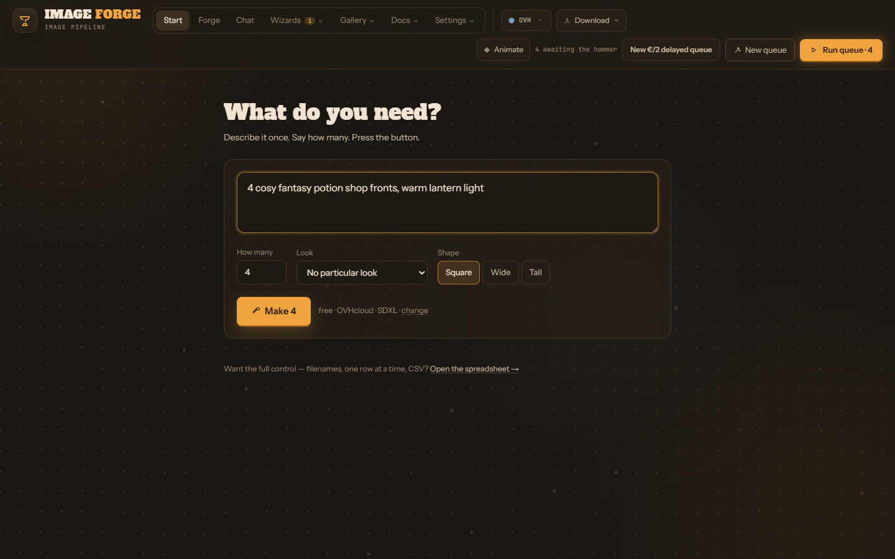
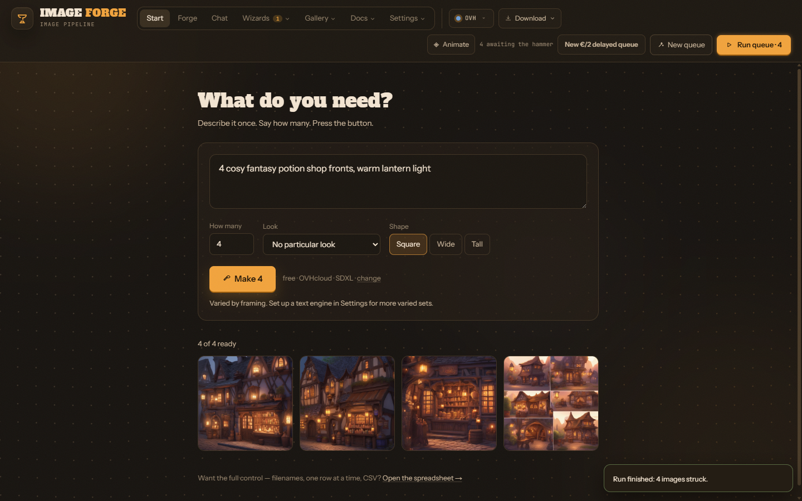
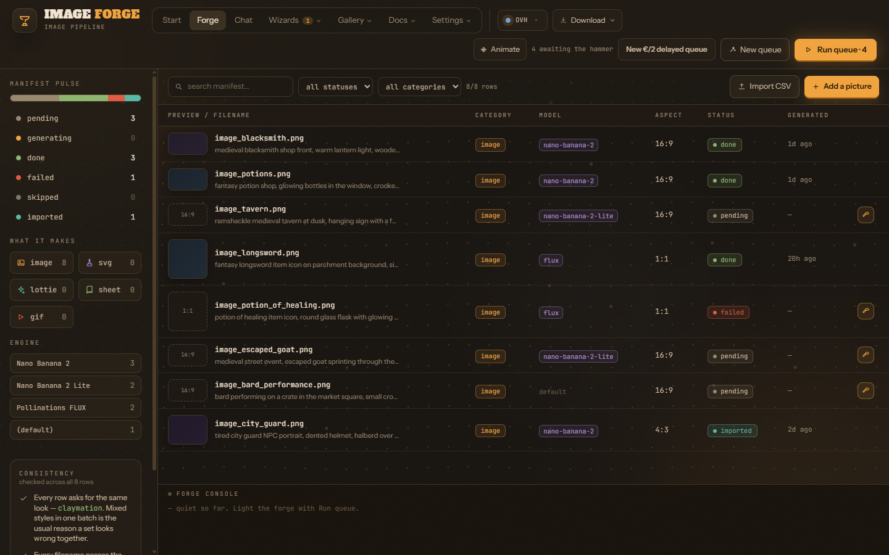
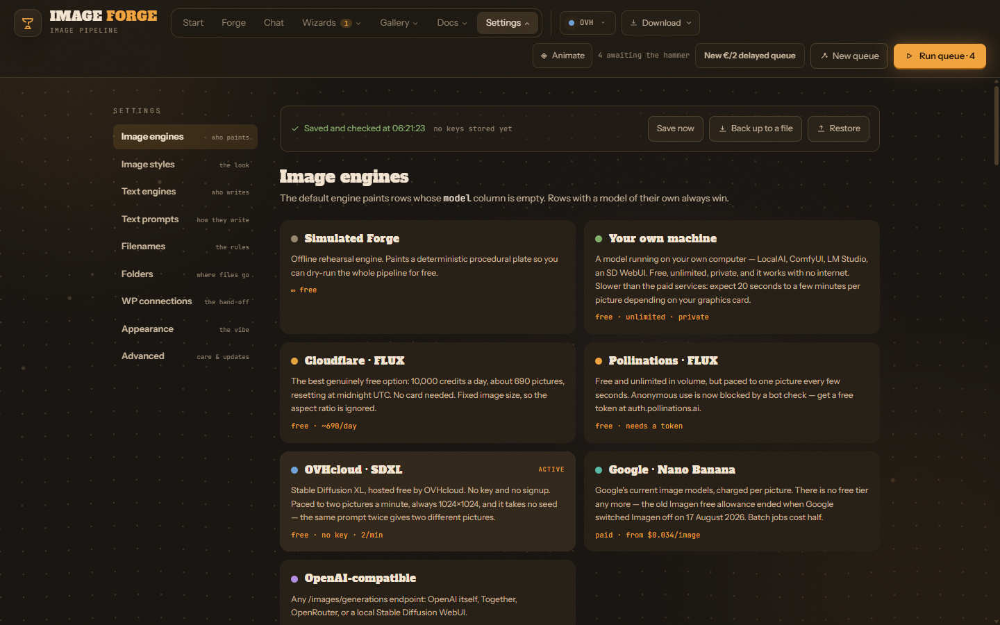
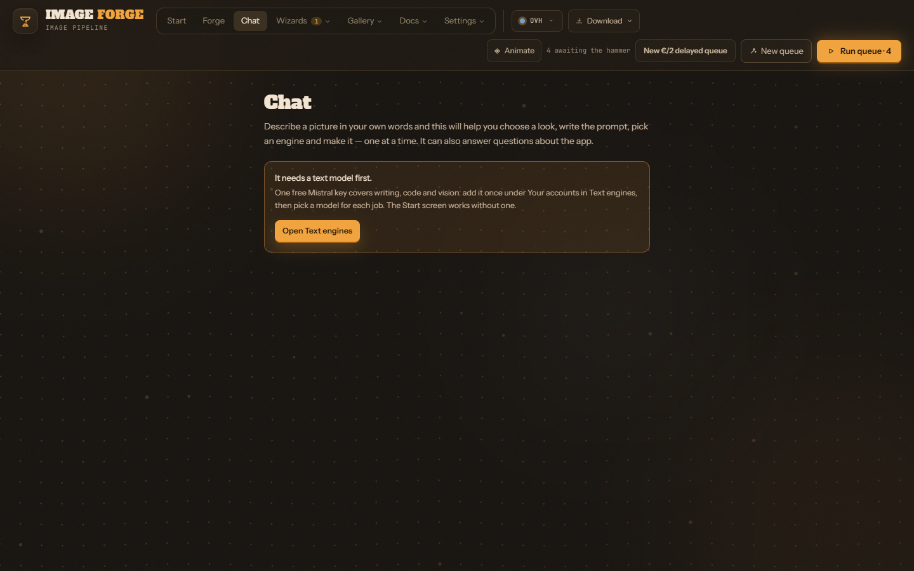
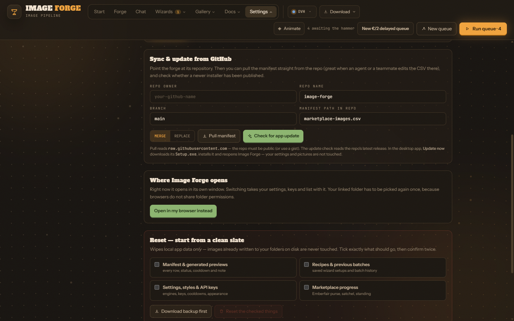

# The Image Forge manual

Everything the app does, in the order you will meet it. No big words; where a
word is unavoidable it is explained the first time.

Three shorter versions of this — for developers, in plain English, and for a
five-year-old — are on the [documentation site](https://docs.stravelakis.com/image-forge/).

---

## 1. What it is

A picture-making factory on your computer. You say what you want and how
many; it asks an AI image service to draw them, names each file sensibly and
puts it in a folder, and keeps a list of what happened to each one.

The AI services are called **engines**. Some are free, one needs no signup at
all, some cost money per picture. The app never spends money without asking.

To use some engines you need a **key** — a long password from the company
that runs the engine. Your keys stay on your computer and are sent only to the
engine you picked.

---

## 2. Install it

See [INSTALL.md](INSTALL.md). In short: download the installer from the
[releases page](https://github.com/Stravelakis/image-forge/releases/latest),
run it, click **More info → Run anyway** on the blue Windows box.

---

## 3. Your first pictures — the Start screen

The app opens here.



1. **What do you need?** — describe it: *"12 potion bottle icons, cute"*.
2. **How many** — filled in from a number at the start of your sentence, or
   set it yourself (up to 60).
3. **Look** — optional. Your starred looks come first.
4. **Shape** — square, wide or tall.
5. Press **Make**.

The line next to the button says which engine will draw them and whether it
costs money. With nothing set up it is **OVHcloud**: free, no key, two
pictures a minute, always square.



**How the set is varied.** With a text engine set up (section 7), it writes a
genuinely different prompt for each picture. Without one it varies the
framing — close-up, from above, evening light — and says so under the button.

Click any finished picture to see it full size.

---

## 4. The spreadsheet — the Forge

Everything you make is a **row** in a list called the **manifest**. **Forge**
in the top menu shows it.



One row is one picture: a filename, a prompt (the description), a look, a
shape, and optionally which engine should draw it. You can add rows, import a
CSV, edit any row, and press **Run queue** to make everything still pending.

A row goes **pending → generating → done**, or **failed** with a plain-words
reason. Rows that hit an engine's daily limit wait and retry by themselves.

**Filenames** follow rules you can see and switch in **Settings → Filenames**.
Two always apply: no characters Windows refuses, and no two rows with the same
name. A file's ending follows what the engine actually returned — Google and
Cloudflare send JPEG, so those files end in `.jpg`.

The **Wizard** (under **Wizards**) sets up a whole batch one question at a
time, if you prefer being walked through it.

---

## 5. Where the pictures go

Pictures live inside the app until you take them out. Three ways:

- **Link folder** (best) — pick a folder; every finished picture is written
  there as it finishes, sorted into `images/`, `vectors/`, `lottie/`,
  `sheets/` and `gifs/`. Point it at a OneDrive or Google Drive folder for free
  cloud backup.
- **Download** → ZIP — every picture in its folder, plus the list as a CSV.
- **Save picture** — one at a time, from its row.

---

## 6. Engines and money

| Engine | Cost | Needs | Good for |
|---|---|---|---|
| **OVHcloud SDXL** | free | nothing | starting straight away; two a minute, always square |
| **Cloudflare** | free | a free account id and token, no card | about 690 pictures a day |
| **Pollinations** | free | a free token | unlimited, slow |
| **Your own machine** | free | an image model running locally | unlimited and private |
| **Google (Nano Banana)** | from $0.034 a picture | a key with a prepay balance | readable words in pictures, complicated instructions |
| **OpenAI-compatible** | about $0.04 a picture | a key | when you already pay for one |

Set them up in **Settings → Image engines**; each has a **Check** button that
makes a real call and explains any failure. Several keys per engine are fine:
when one runs out, the next takes over.

**A paid run always stops first** and shows how many pictures will be billed,
the model, the price each, the total, which credit pays, and free engines to
switch to instead. Nothing is spent until you press **Spend it**.



The bar at the top of Settings shows when your settings were last **saved and
checked**, how many keys are stored (never the keys themselves), and **Save
now**, **Back up to a file** and **Restore**.

---

## 7. Text engines and the Chat

A **text engine** is a language model that writes rather than draws. Image
Forge uses one for three jobs: **writing** (prompts, chat), **code** (SVG and
Lottie vectors) and **vision** (finding where lettering goes on a picture).

In **Settings → Text engines**, add an account once under **Your accounts**
(Mistral, OpenAI, OpenRouter, Google, NVIDIA or your own machine), press
**Load its models**, then pick a model for each job. One free Mistral key
covers all three.

**Chat** in the top menu lets you ask for a picture in your own words, write a
whole list of rows at once, change rows you already have (you see every
change before it is applied), or ask how the app works.



---

## 8. Looks, sheets, GIFs and lettering

- **Looks** (Gallery → Styles) — 36 styles in six families. Star the ones you
  use. A few need readable words and are limited to models that can spell.
- **Sheets** — sets of frames of one character: walk cycles, turnarounds,
  expressions, and **visemes** (mouth shapes for a talking avatar). Each frame
  gets its own seed and a "change only this" instruction.
- **GIFs** — animate a finished picture with camera movement, free.
- **Letterer** — put real, correctly spelled text on a picture and drag its
  four corners so it sits on a sign or a wall.
- **Vectors** — SVG and Lottie written by the code engine, cleaned of
  anything unsafe before they are shown or saved.

---

## 9. Working with BYOK Vid Creator

If both apps are installed on the same computer, **BYOK Vid Creator can ask
Image Forge for pictures** — for example mouth-shape sheets for its talking
characters:

```bash
npm run ask-forge -- visemes kaiti --sheets viseme-sheets-v2
```

(run inside the vid creator's folder).

- Image Forge does not need to be open when asked; the request waits in its
  inbox until it is.
- Requests on free engines start by themselves and appear in the Forge with
  the note *"asked for by BYOK Vid Creator"*. Paid ones stop at the usual
  dialog.
- Your keys never leave Image Forge.
- **Check sheets by eye.** Free engines often draw one picture when asked for
  a grid of nine panels; the tools say so every time. A Google model follows
  grid instructions far better.

How it works underneath: [HANDOFF.md §14.2](HANDOFF.md).

---

## 10. Window or browser, and updates

**Settings → Advanced → Where Image Forge opens.** Pick your own browser
instead of the app window if you prefer tabs. Everything you have set up goes
with it. In browser mode a small Image Forge icon sits by the clock; click it
to open another tab, right-click it to quit. Your linked folder needs picking
again once after switching.



**Updates.** Settings → Advanced → **Check for app update**. If there is a
newer version, **Update now** downloads it from the official release page,
installs it and reopens Image Forge — a minute or two. Your keys, settings and
pictures are not touched.

---

## 11. When something goes wrong

| You see | What it means |
|---|---|
| A row says **failed** | Click it and read the red note; press **Generate** again |
| "Every key is resting" | The engine hit its limit; rows retry by themselves |
| Google: "prepayment credits are depleted" | The account has no picture balance — the key check says which fix you need |
| Settings say "NOT saved" | Press **Back up to a file** before closing |
| "Could not read your manifest" | Nothing was overwritten; the original is kept aside. Press **Try again**, or restore a backup |
| Text in a picture is gibberish | Most engines cannot spell; use a Google model or the Letterer |
| Everything feels off | **Settings → Advanced → Run repair** |

Every problem found so far, with its real cause: [docs/troubleshooting.md](docs/troubleshooting.md).

---

## 12. For agents and developers

- Let an AI agent drive it: [docs/vibe-coding.md](docs/vibe-coding.md),
  [CONNECT-AGENTS.md](CONNECT-AGENTS.md).
- Change the code: [docs/developers.md](docs/developers.md),
  [HANDOFF.md](HANDOFF.md), [STANDARDS.md](STANDARDS.md).
- Ship it: [DEPLOY.md](DEPLOY.md).
